# Search Gateway — AI-Oriented Multi-Provider Search Engine

> **Architectural layer** that turns any search provider (Yandex, Brave, Perplexity, Bing) into a unified **Perplexity / Comet / Atlas / DIA-style** AI search backend.

[](https://github.com/nanocubit/search-gateway/actions/workflows/ci.yml)
[](https://github.com/nanocubit/search-gateway/actions/workflows/codeql.yml)
[](https://github.com/nanocubit/search-gateway/actions/workflows/cd.yml)
[](https://www.php.net)
[](https://phpstan.org)
[](https://www.php-fig.org/psr/psr-12/)
[](LICENSE)

---

## Status

| Gate | Result |
|------|--------|
| PHPUnit 11 | **380 passed / 0 failed / 2 skipped** (963 assertions) |
| PHPCS PSR-12 (lineLimit 140) | **0 errors / 0 warnings** |
| PHPStan level 9 | **0 errors** |
| Standalone `tools/ci-verify.php` (no vendor) | **81 passed / 0 failed / 3 skipped** |
| Test matrix | PHP 8.2 / 8.3 / 8.4 × dependency mode lowest / highest |
| PHP | 8.2+ (tested on 8.2.31 NTS x64) |

The Universal API adds **~155 new tests** on top of the existing 107 library tests. The 2 SKIPs are multi-worker integration checks exercised in production only.

**380 tests by domain**:
- 10 — AdaptiveRetriever (Retrieval)
- 12 — CrossEncoderReranker (Reranker)
- 21 — SearchGuardrails (Guardrails)
- 12 — KnowledgeGraphExtractor (Graph)
- 52 — existing library (resilience, decorators, gateways, builder, tools, agents, ranker, prompt, formatter, LLM)
- 52 — Gateways (Brave, Mock, HybridBrowserHistory)
- **~155 — Universal API** (router, API keys, plugins, middleware, controllers, admin, portal, streaming, observability, request DTOs, browser history route)

---

## Philosophy

Instead of writing ad-hoc integrations for every search API, you get:

1. **One contract** (`SearchGatewayInterface`) — interchangeable providers.
2. **Decorators** — cache, retry, metrics, logging, LLM answer synthesis, fallback chains, circuit breaker, rate limiter, event bus.
3. **Multi-provider RAG** — aggregate, deduplicate, re-rank and filter results from several engines.
4. **Agent layer** — step-based workflows with personal context memory.
5. **Production resilience** — circuit breakers, rate limiters, health checks, async parallel queries.
6. **Developer experience** — fluent builder, mock gateway, prompt builder, response formatters, streaming.

---

## Architecture (7 Levels)

```mermaid
graph TB
    subgraph L1["L1 — Contract"]
        A[SearchGatewayInterface]
        B[GenerativeSearchResultDTO]
        C[SearchGatewayException]
    end

    subgraph L2["L2 — Infrastructure"]
        I1[HttpClientInterface]
        I2[CacheInterface]
        I3[MetricsInterface]
        I4[LoggerInterface]
        I5[LLMClientInterface]
        I6[RateLimiterInterface]
        I7[EventBusInterface]
        I8[AsyncHttpClientInterface]
        I9[StreamingResponseInterface]
    end

    subgraph L3["L3 — Providers"]
        Y[YandexCloudSearchGateway]
        Br[BraveSearchGateway]
        P[PerplexitySearchGateway]
        Bi[BingSearchGateway]
        M[MockSearchGateway]
    end

    subgraph L4["L4 — Decorators"]
        C1[CachedSearchGatewayDecorator]
        C2[RetryingSearchGatewayDecorator]
        C3[MetricsSearchGatewayDecorator]
        C4[LoggerSearchGatewayDecorator]
        C5[LLMAnswerSearchGatewayDecorator]
        C6[FallbackSearchGatewayDecorator]
        C7[CircuitBreakerSearchGatewayDecorator]
        C8[RateLimitedSearchGatewayDecorator]
        C9[EventBusSearchGatewayDecorator]
    end

    subgraph L5["L5 — Tools & Multi"]
        T1[SearchTool]
        T2[MultiSearchGateway]
        T3[AsyncMultiSearchGateway]
        T4[GatewayBuilder]
        T5[StreamingSearchGateway]
    end

    subgraph L6["L6 — Ranker & Prompt"]
        R1[SearchResultRanker]
        R2[SearchResultFilter]
        R3[PromptBuilder]
        R4[ResponseFormatter]
    end

    subgraph L7["L7 — Agent"]
        Ag[AgentWorkflow]
        Pe[PersonalSearchContext]
        H[HealthChecker]
    end

    A --> Y & Br & P & Bi & M
    I1 & I2 & I3 & I4 & I5 & I6 & I7 & I8 & I9 --> C1 & C2 & C3 & C4 & C5 & C6 & C7 & C8 & C9
    Y & Br & P & Bi & M --> C1 & C2 & C3 & C4 & C5 & C6 & C7 & C8 & C9
    C1 & C2 & C3 & C4 & C5 & C6 & C7 & C8 & C9 --> T1 & T2 & T3 & T4 & T5
    T1 & T2 & T3 & T4 & T5 --> R1 & R2 & R3 & R4
    R1 & R2 & R3 & R4 --> Ag
    Ag --> Pe
    H --> Y & Br & P & Bi
    RCBR[RedisCircuitBreaker] --> D_CB
    IMCB[InMemoryCircuitBreaker] --> D_CB
    GCH[GuzzleConcurrentHttpClient] --> T_AS
    OC[OllamaLLMClient] --> S
```



## Production Components (added in 2.0)

| Component | Purpose | Storage / Backend |
|-----------|---------|-------------------|
| `RedisCircuitBreaker` | Atomic distributed circuit breaker for multi-process safety | Redis (phpredis / Predis) |
| `InMemoryCircuitBreaker` | In-process CB; the previous default, now a class that implements `CircuitBreakerInterface` | RAM |
| `GuzzleConcurrentHttpClient` | Real parallel HTTP fan-out for PHP-FPM (no Swoole required) | `GuzzleHttp\Pool` |
| `OllamaLLMClient` | Local LLM (text + NDJSON streaming) | Ollama `/api/generate` |
| `OllamaChatLLMClient` | Multi-turn chat | Ollama `/api/chat` |
| `StreamingLLMClientInterface` | Typed streaming contract (replaces the `method_exists` duck-typing) | — |
| `AsyncRequestBuilderInterface` | Optional opt-in for gateways that can describe their HTTP request for parallel dispatch | — |

| Level | Responsibility | Inspired by |
|-------|----------------|-------------|
| **L1** | Unified interfaces & DTOs | Perplexity API, Comet SDK |
| **L2** | Infrastructure abstractions | PSR standards, Redis, Prometheus |
| **L3** | Provider-specific HTTP adapters | Yandex Search API, Brave API, Bing v7 |
| **L4** | Cross-cutting concerns | Perplexity cache, Brave resilience, Atlas LLM synthesis, DIA events |
| **L5** | High-level tools & hybrid RAG | Perplexity hybrid search, async aggregation |
| **L6** | Ranking, filtering, prompts, formatting | BM25-like signals, structured output |
| **L7** | Agent orchestration, memory, health | Comet agents, DIA workflows, Atlas personal context |

---

## Installation

```bash
composer require nanocubit/search-gateway
```

### Laravel

```bash
php artisan vendor:publish --tag=search-gateway
```

Add to `.env`:

```env
YANDEX_SEARCH_ENABLED=true
BRAVE_SEARCH_ENABLED=true
BRAVE_API_KEY=your_key
SEARCH_CACHE_ENABLED=true
SEARCH_RETRY_ENABLED=true
```

---

## Quick Start

### 1. Single Provider (Yandex)

```php
use SearchGateway\Gateway\YandexCloudSearchGateway;
use SearchGateway\Tool\SearchTool;

$gateway = new YandexCloudSearchGateway($yandexSdkClient);
$tool    = new SearchTool($gateway);

$docs = $tool->context('PHP 8.4 JIT performance');
echo $tool->formatDocs($docs);
```

### 2. Decorated Provider (Production Grade)

```php
use SearchGateway\Decorator\CachedSearchGatewayDecorator;
use SearchGateway\Decorator\RetryingSearchGatewayDecorator;
use SearchGateway\Decorator\MetricsSearchGatewayDecorator;

$search = new MetricsSearchGatewayDecorator(
    new RetryingSearchGatewayDecorator(
        new CachedSearchGatewayDecorator($gateway, $redis),
        retries: 2,
        delayMs: 200
    ),
    $statsd
);
```

### 3. Fluent Builder (Recommended)

```php
use SearchGateway\Builder\GatewayBuilder;

$search = (new GatewayBuilder())
    ->addYandex($yandexClient)
    ->addBrave($http, $_ENV['BRAVE_API_KEY'])
    ->withCache($redis, 3600)
    ->withRetry(2, 150)
    ->withMetrics($statsd)
    ->withCircuitBreaker('search', threshold: 5, timeout: 30)
    ->withRateLimit($rateLimiter, 'brave', max: 60, window: 60)
    ->withFallback(new MockSearchGateway())
    ->build();
```

### 4. Multi-Provider Hybrid (Perplexity-style)

```php
use SearchGateway\Tool\MultiSearchGateway;

$multi = new MultiSearchGateway([
    new YandexCloudSearchGateway($yandexClient),
    new BraveSearchGateway($http, $braveKey),
    new PerplexitySearchGateway($http, $ppxKey),
]);

$tool = new SearchTool($multi);
$ctx  = $tool->context('Latest AI model benchmarks', ['docsOnPage' => 15]);
```

### 5. Async Parallel Multi-Provider

```php
use SearchGateway\Tool\AsyncMultiSearchGateway;

$async = new AsyncMultiSearchGateway([
    new YandexCloudSearchGateway($yandexClient),
    new BraveSearchGateway($http, $braveKey),
], $asyncHttp);

$ctx = $async->llmContext('Quantum computing 2026'); // Fires both in parallel
```

### 6. Smart Ranking & Filtering

```php
use SearchGateway\Ranker\SearchResultRanker;
use SearchGateway\Ranker\SearchResultFilter;

$ranker = new SearchResultRanker();
$filter = new SearchResultFilter();

$docs = $gateway->searchWeb('PHP 8.4');
$docs = $filter->filter($docs, [
    'boost_domains' => ['php.net', 'github.com'],
    'penalty_domains' => ['spam.example.com'],
    'max_age_days' => 365,
]);
$docs = $ranker->rank($docs, 'PHP 8.4', [
    'strategy' => 'default',
    'recency_weight' => 0.2,
]);
```

### 7. LLM Answer Synthesis (Atlas-style)

```php
use SearchGateway\Decorator\LLMAnswerSearchGatewayDecorator;

$gateway = new LLMAnswerSearchGatewayDecorator(
    new BraveSearchGateway($http, $braveKey),
    $openAiClient,
    systemPrompt: 'You are a senior research analyst. Cite every claim.'
);

$answer = $gateway->searchGen('Quantum computing 2026 outlook');
echo $answer->answer;
```

### 8. Streaming Generative Search

```php
use SearchGateway\Streaming\StreamingSearchGateway;

$streamer = new StreamingSearchGateway($gateway, $llm);

foreach ($streamer->streamGen('Explain PHP 8.4') as $chunk) {
    echo $chunk; // SSE output or WebSocket push
}
```

### 9. Agent Workflow (Comet / DIA-style)

```php
use SearchGateway\Agent\AgentWorkflow;
use SearchGateway\Agent\PersonalSearchContext;

$personal = new PersonalSearchContext();
$personal->setProfile('language', 'ru');

$agent = new AgentWorkflow($tool, $llm, $personal);

$agent->addStep(function (array $ctx, AgentWorkflow $w): array {
    if (str_contains($ctx['task'], 'benchmark')) {
        $ctx['extra'] = $w->searchTool()->web($ctx['task'] . ' benchmark')[0]['passage'] ?? '';
    }
    return $ctx;
});

echo $agent->run('Сравни PHP 8.3 и 8.4 в реальных бенчмарках');
```

### 10. Health Check

```php
use SearchGateway\Health\HealthChecker;

$checker = new HealthChecker([
    'yandex' => $yandexGateway,
    'brave' => $braveGateway,
]);

print_r($checker->check());
// ['yandex' => ['status' => 'healthy', 'latency_ms' => 120, 'error' => null], ...]
```

### 11. Mock Gateway (Testing)

```php
use SearchGateway\Gateway\MockSearchGateway;

$mock = new MockSearchGateway([
    'searchWeb' => [
        ['type' => 'web', 'title' => 'Test', 'url' => 'https://test.com', 'passage' => 'P', 'score' => 1.0],
    ],
]);

$tool = new SearchTool($mock);
$docs = $tool->context('anything'); // Returns configured mock data
```

### 12. Event Bus (Observability)

```php
use SearchGateway\Decorator\EventBusSearchGatewayDecorator;

$bus = new class implements EventBusInterface {
    public function subscribe(string $event, callable $listener): void {}
    public function emit(string $event, array $payload): void {
        error_log("[{$event}] " . json_encode($payload));
    }
};

$gateway = new EventBusSearchGatewayDecorator($gateway, $bus, 'yandex');
```

### 13. Prompt Builder

```php
use SearchGateway\Prompt\PromptBuilder;

$prompt = (new PromptBuilder())
    ->system('You are a senior PHP architect.')
    ->task('Compare PHP 8.3 and 8.4')
    ->sources($docs)
    ->format('markdown')
    ->tone('technical')
    ->maxWords(300)
    ->build();

$answer = $llm->generate($prompt);
```

### 14. Response Formatter

```php
use SearchGateway\Formatter\ResponseFormatter;

$fmt = new ResponseFormatter();
echo $fmt->toMarkdown($dto);
echo $fmt->toJson($dto);
echo $fmt->toHtml($dto);
echo $fmt->toTemplate($dto, 'Answer: {answer}\nSources: {sources}');
```

---

## Adaptive Retrieval, Reranking & Output Guardrails

The library ships with three high-leverage subsystems that sit on top of the
core contract + decorator stack. They are framework-agnostic and work with any
`SearchGatewayInterface` implementation.

### 15. Adaptive retrieval (web / vector / hybrid auto-routing)

`AdaptiveRetriever` chooses the best retrieval strategy per query — web search
for fresh / external information, vector store for internal documents, hybrid
for comparison-style queries. Two-tier classification:

1. **Fast keyword heuristic** (RU+EN) — zero LLM cost for clear cases
2. **LLM fallback** — only for ambiguous queries that don't match any heuristic

```php
use SearchGateway\Retrieval\AdaptiveRetriever;
use SearchGateway\Embedding\EmbeddingInterface;

$retriever = new AdaptiveRetriever(
    webSearch: $gateway,
    vectorStore: $vectorStore,
    llm: $llm,
    embedding: $embedding,   // optional; if null, vector branch degrades to web
);

$result = $retriever->retrieve('Latest news about PHP 8.4');
// [
//   'strategy' => 'web',     // or 'vector' / 'hybrid'
//   'intent'   => 'web',     // detected intent: web / vector / hybrid / ambiguous
//   'results'  => [ ...docs ],
// ]

$result = $retriever->retrieve('Compare PHP vs Python benchmark');
// ['strategy' => 'hybrid', 'intent' => 'hybrid', 'results' => [web+vector, deduped by URL]]

$result = $retriever->retrieve('our internal policy document', ['k' => 10]);
// ['strategy' => 'vector', ...]  // routes to internal knowledge base
```

**Heuristics** (no LLM cost):

| Intent | Trigger keywords (RU+EN) |
|--------|--------------------------|
| `web` | `news`, `latest`, `today`, `current`, `2024..2030`, `новост`, `сегодня`, `актуальн` |
| `vector` | `document`, `internal`, `knowledge base`, `our`, `policy`, `wiki`, `history`, `внутренн`, `наш`, `политик`, `вики` |
| `hybrid` | `compare`, `vs`, `benchmark`, `analysis`, `сравни`, `бенчмарк`, `анализ` |
| `ambiguous` | anything else → LLM classifier |

Hybrid branch dedups by URL, so the same document never appears twice.

### 16. Cross-encoder reranking (Ollama / OpenAI / YandexGPT)

`CrossEncoderReranker` uses an LLM as a judge to re-score the top-N documents
returned by any retrieval step. Two operating modes:

| Mode | LLM calls | Best for |
|------|-----------|----------|
| `MODE_SINGLE` | N (one per doc) | High accuracy, slower, more tokens |
| `MODE_BATCH` | 1 (all docs at once) | Cheaper, fewer tokens, slightly less accurate |

```php
use SearchGateway\Reranker\CrossEncoderReranker;

// Single mode (default) — one prompt per document
$reranker = new CrossEncoderReranker(
    llm: $ollamaClient,
    mode: CrossEncoderReranker::MODE_SINGLE,
);

$top = $reranker->rerank($docs, 'php 8.4 jit performance', topK: 5);
// Each result is enriched with '_rerank_score' (float 0.0–1.0)

// Batch mode — single prompt for all docs, parses a multi-line response
$reranker = new CrossEncoderReranker(
    llm: $openAiClient,
    systemPrompt: 'Rate relevance to the query. Reply with one number per line.',
    mode: CrossEncoderReranker::MODE_BATCH,
);

$top = $reranker->rerank($docs, 'php 8.4 jit performance', topK: 5);
```

The reranker is **field-tolerant**: it reads `passage`, falling back to
`description`, then to `snippet` if the field is missing. Scores outside
`[0.0, 1.0]` are clamped. Unparseable responses default to a neutral 0.5.

Typical pipeline:

```php
$candidates = $gateway->llmContext('php 8.4 benchmarks');   // 10–20 docs
$reranked   = $reranker->rerank($candidates, $query, topK: 5);
$dto        = $llm->generateAnswer($query, $reranked);
```

### 17. Output guardrails (hallucination + citation + PII)

`SearchGuardrails` is a chainable validator. Each validator is a callable
that receives the prepared payload and returns `null` (ok) or a string
(violation). Drop-in built-ins cover the most common failure modes:

| Validator | Catches |
|-----------|---------|
| `noEmptyAnswer()` | Empty / whitespace-only answers |
| `minSources(int $min)` | Answers with too few sources |
| `maxAnswerLength(int $max)` | Overly verbose responses |
| `noBlockedDomains(array)` | Sources from blacklisted domains or URLs (substring match) |
| `answerContainsCitations()` | Answers without `[1]`, `[2]` markers |
| `noHallucinations()` | Citations `[N]` that don't map to a real source |
| `requiredUrls(array, checkSources)` | Required URLs / domains not present in answer or sources |
| `minCitationCoverage(float $ratio)` | Less than N% of citations are valid |
| `noPii(?array $extraPatterns)` | Email / phone / credit-card patterns |

```php
use SearchGateway\Guardrails\SearchGuardrails;
use SearchGateway\Formatter\ResponseFormatter;

$guard = (new SearchGuardrails())
    ->addValidator(SearchGuardrails::noEmptyAnswer())
    ->addValidator(SearchGuardrails::minSources(2))
    ->addValidator(SearchGuardrails::noHallucinations())
    ->addValidator(SearchGuardrails::minCitationCoverage(0.5))
    ->addValidator(SearchGuardrails::noBlockedDomains(['spam.com', 'fake-news.org']))
    ->addValidator(SearchGuardrails::requiredUrls(['php.net', 'wikipedia.org']))
    ->addValidator(SearchGuardrails::noPii());

$violations = $guard->validate($dto);
if ($violations !== []) {
    // log, retry with stricter prompt, return fallback answer, etc.
    foreach ($violations as $v) {
        error_log("Guardrail violation: {$v}");
    }
}
```

**Hallucination guard** in detail: every `[N]` in the answer must satisfy
`1 ≤ N ≤ count($sources)`. Citations outside that range (including `[0]`)
are flagged. The violation message lists the offending indices.

**Required URLs**: accepts full URLs (`https://php.net/release`) or bare
domains (`php.net`). By default, both the answer text and the sources list
are searched; pass `checkSources: false` to require literal mention in the
answer only.

**Custom validators** are first-class:

```php
$guard->addValidator(static function (array $data): ?string {
    $answer = is_scalar($data['answer'] ?? null) ? (string) $data['answer'] : '';
    return str_contains(strtolower($answer), 'forbidden')
        ? 'Answer contains forbidden word'
        : null;
});
```

### 18. Test mocks (for your own tests)

The library ships reusable test doubles in `tests/Support/`:

```php
use SearchGateway\Tests\Support\MockLLMClient;
use SearchGateway\Tests\Support\InMemoryVectorStore;

// Configurable LLM that records every prompt it received
$llm = new MockLLMClient(['0.9', '0.1', '0.5']);

// In-memory vector store — no Redis required
$vec = new InMemoryVectorStore([
    ['id' => 'd1', 'vector' => [0.1, 0.2], 'meta' => ['url' => 'kb://1', 'passage' => 'p']],
]);
```

The namespace is `SearchGateway\Tests\Support\`; in your own project you can
copy these files or `Mockery`-mock the `LLMClientInterface` /
`VectorStoreInterface` directly.

---

## Provider Matrix

| Feature | Yandex | Brave | Perplexity | Bing | HybridBrowserHistory |
|---------|--------|-------|------------|------|----------------------|
| `searchWeb` | ✅ | ✅ | ✅* | ✅ | ✅ |
| `searchNews` | ✅ | ✅ | ✅* | ✅ | ❌ |
| `searchImages` | ✅ | ✅ | ❌ | ✅ | ❌ |
| `searchGen` | ✅ | ❌ | ✅ | ❌ | ❌ |
| `wordstat` | ✅ | ❌ | ❌ | ❌ | ❌ |
| `llmContext` | ✅ | ✅ | ✅ | ✅ | ❌ |

*Perplexity synthesises from citations.

---

## Decorator Reference

| Decorator | Purpose | Config |
|-----------|---------|--------|
| `CachedSearchGatewayDecorator` | Perplexity-style result cache | TTL, `CacheInterface` |
| `RetryingSearchGatewayDecorator` | Exponential backoff | Max retries, base delay |
| `MetricsSearchGatewayDecorator` | StatsD / Prometheus timing | `MetricsInterface` |
| `LoggerSearchGatewayDecorator` | PSR-3 audit logging | `LoggerInterface` |
| `LLMAnswerSearchGatewayDecorator` | Atlas-style answer synthesis | `LLMClientInterface`, prompt |
| `FallbackSearchGatewayDecorator` | Circuit-breaker chain | List of fallback gateways |
| `CircuitBreakerSearchGatewayDecorator` | Resilience (Closed/Open/Half-Open) | `CircuitBreaker` |
| `RateLimitedSearchGatewayDecorator` | Token bucket rate limiting | `RateLimiterInterface` |
| `EventBusSearchGatewayDecorator` | Lifecycle event emission | `EventBusInterface` |

---

## Production checklist

### Composer suggests (install only what you use)

```bash
composer require guzzlehttp/guzzle:^7.0       # GuzzleConcurrentHttpClient + Ollama streaming
composer require guzzlehttp/psr7:^2.0
composer require predis/predis:^2.0           # OR use ext-redis (PhpRedisClientAdapter)
```

### Environment variables (Laravel)

```env
# Search providers
YANDEX_SEARCH_ENABLED=false
BRAVE_SEARCH_ENABLED=true
BRAVE_API_KEY=your_key

# Resilience
SEARCH_CIRCUIT_BREAKER_DRIVER=redis          # memory|redis
SEARCH_CIRCUIT_BREAKER_NAME=search
SEARCH_CIRCUIT_BREAKER_THRESHOLD=5
SEARCH_CIRCUIT_BREAKER_TIMEOUT=30
SEARCH_CIRCUIT_BREAKER_HALF_OPEN_MAX=3

# Async / concurrency
SEARCH_ASYNC_ENABLED=true
SEARCH_ASYNC_DRIVER=guzzle
SEARCH_ASYNC_CONCURRENCY=5
SEARCH_ASYNC_TIMEOUT=5.0

# Ollama (local LLM)
OLLAMA_ENABLED=true
OLLAMA_BASE_URI=http://localhost:11434
OLLAMA_MODEL=llama3.2
OLLAMA_SYSTEM_PROMPT="You are an AI search assistant..."

# Caching / retry / metrics
SEARCH_CACHE_ENABLED=true
SEARCH_CACHE_TTL=3600
SEARCH_RETRY_ENABLED=true
SEARCH_METRICS_ENABLED=false
```

### Building a distributed-resilient gateway

```php
use GuzzleHttp\Client;
use SearchGateway\Builder\GatewayBuilder;
use SearchGateway\Infrastructure\GuzzleConcurrentHttpClient;
use SearchGateway\Infrastructure\PhpRedisClientAdapter;
use SearchGateway\Resilience\RedisCircuitBreaker;

$r = new \Redis();
$r->connect('127.0.0.1', 6379);
$redis = new PhpRedisClientAdapter($r);

$guzzle = new Client(['timeout' => 5.0, 'http_errors' => false]);
$async  = new GuzzleConcurrentHttpClient($guzzle, $psr3Logger, concurrency: 5);

$gateway = (new GatewayBuilder())
    ->addYandex($yandexSdk)
    ->addBrave($guzzle, $_ENV['BRAVE_API_KEY'])
    ->withCache($redis, 3600)
    ->withRetry(2, 150)
    ->withMetrics($statsd)
    ->withRedisCircuitBreaker($redis, 'search', threshold: 5, timeout: 30)
    ->withGuzzleConcurrentClient($guzzle, $psr3Logger, concurrency: 5)
    ->withFallback(new \SearchGateway\Gateway\MockSearchGateway())
    ->build();
```

### Local LLM with Ollama

```php
$guzzle = new Client(['timeout' => 120, 'http_errors' => false]);
$llm = new \SearchGateway\LLM\OllamaLLMClient(
    $yourHttpClient,
    baseUri: 'http://localhost:11434',
    model: 'llama3.2',
    streamingClient: $guzzle,
);

$gateway = (new GatewayBuilder())
    ->addBrave($guzzle, $braveKey)
    ->withOllamaLLM($yourHttpClient, 'http://localhost:11434', 'llama3.2', $guzzle)
    ->build();   // LLMAnswerSearchGatewayDecorator is auto-applied
```

### Streaming answers (SSE / NDJSON)

```php
$streamer = (new GatewayBuilder())
    ->addBrave($guzzle, $braveKey)
    ->withOllamaLLM($http, 'http://localhost:11434', 'llama3.2', $guzzle)
    ->buildStreamer();

$gen = $streamer->streamGen('What is new in PHP 8.4?');
foreach ($gen as $chunk) { echo $chunk; flush(); }
$dto = $gen->getReturn();
```

### BC: `CircuitBreaker` extends `InMemoryCircuitBreaker`

The class was renamed to `InMemoryCircuitBreaker`. The old name is preserved as a thin
`extends InMemoryCircuitBreaker` subclass — no `class_alias`, no deprecation warnings,
fully BC-compatible with type checks and `instanceof`.

```php
use SearchGateway\Resilience\CircuitBreaker;   // extends InMemoryCircuitBreaker
$cb = new CircuitBreaker('search', failureThreshold: 5, recoveryTimeoutSeconds: 30);
```

---

## Testing

```bash
make install   # composer install
make test      # PHPUnit
make analyse   # PHPStan level 9
make style     # PHPCS PSR-12
make fix       # PHPCBF auto-fix
make ci        # Full CI pipeline
```

### Requirements for the test suite

The PHPUnit suite, PHPStan level 9, and the production components exercise several
optional backends. Install only what your environment can provide; missing
extensions are skipped, not failed.

| What | Why | Install |
|------|-----|---------|
| `ext-redis` (phpredis) | `RedisCircuitBreaker`, `PhpRedisClientAdapter`, `RedisCircuitBreakerTest` | `pecl install redis` and enable in `php.ini` |
| `ext-curl` + `ext-openssl` | `GuzzleHttp\Client` is used by `GuzzleConcurrentHttpClient` and the Ollama examples | Bundled with most PHP distributions; on Windows enable in `php.ini` |
| `predis/predis` ^2.0 | Pure-PHP alternative to `ext-redis` (uses `PredisClientAdapter`) | `composer require predis/predis` (already a `suggest` entry) |
| `guzzlehttp/guzzle` ^7.0 | `GuzzleConcurrentHttpClient` + Ollama NDJSON streaming | `composer require guzzlehttp/guzzle` |
| `guzzlehttp/psr7` ^2.0 | Required by Guzzle 7 HTTP message types | `composer require guzzlehttp/psr7` |
| `nyholm/psr7` ^1.8 | PSR-7/15 server in dev, used by `PortalController`, `StreamController`, `AdminController` examples | `composer require nyholm/psr7` (in `require-dev`) |
| `nyholm/psr7-server` ^1.1 | PSR-7 `ServerRequestCreator` (test/examples) | `composer require nyholm/psr7-server` (in `require-dev`) |
| `symfony/yaml` ^6.0\|^7.0 | Optional: `RouteConfigLoader` YAML support (else provide your own `YamlParserInterface`) | `composer require symfony/yaml` (in `suggest`) |

#### Quick install (Linux / macOS)

```bash
# System packages
sudo apt-get install -y php-curl php-openssl php-redis     # Debian/Ubuntu
# or
brew install php-redis                                     # macOS

# Composer dev dependencies (covered by `make install`)
composer install
```

#### Quick install (Windows)

```powershell
# 1. PHP itself (via WinGet) — must expose ext-curl, ext-openssl, ext-redis
winget install PHP.PHP.8.2

# 2. ext-redis is NOT bundled — install from PECL
#    See https://github.com/phpredis/phpredis for the matching NTS/X64 DLL
#    and add `extension=redis` to php.ini

# 3. Composer (download composer-setup.php from getcomposer.org)
php composer-setup.php --install-dir=C:\bin

# 4. Project deps
composer install
```

### What runs in CI vs locally

| Target | Requires | What it does |
|--------|----------|--------------|
| `make test` | `composer install` only | Runs PHPUnit on `tests/`. Tests for missing backends are skipped automatically. |
| `make analyse` | `composer install` | PHPStan level 9 over `src/`. The `GuzzleHttp` and `Predis` symbols are resolved via `require-dev`. |
| `make style` | `composer install` | PHPCS PSR-12 over `src/` and `tests/`. |
| `make ci` | All of the above | Full pipeline. |

### Skipped tests (intentional)

- `RedisCircuitBreakerTest::testHalfOpenSaturationRequiresConcurrentWorkers` — the
  saturation guard lives inside an atomic Lua script. Verifying it requires real
  Redis with multiple workers issuing `allowRequest()` simultaneously; single-process
  PHP cannot reproduce that. The Lua logic (`local probes = tonumber(redis.call('INCR', KEYS[4]))` /
  `if probes > halfOpenMax then return 'OPEN' end`) is exercised in integration only.

### Verifying without `composer install`

If you don't have network access or the `composer` binary, you can still sanity-check
the core state machine by hand. Drop the following into the project root and run it
under any PHP 8.2+ interpreter — it uses only the in-process `InMemoryCircuitBreaker`:

```php
<?php
// verify.php — manual smoke test, no Composer, no extensions
spl_autoload_register(function (string $class): void {
    $prefix = 'SearchGateway\\';
    if (!str_starts_with($class, $prefix)) return;
    $path = __DIR__ . '/src/' . str_replace('\\', '/', substr($class, strlen($prefix))) . '.php';
    if (is_file($path)) require $path;
});

use SearchGateway\Resilience\InMemoryCircuitBreaker;

$cb = new InMemoryCircuitBreaker('demo', failureThreshold: 2, recoveryTimeoutSeconds: 0, halfOpenMaxCalls: 1);
for ($i = 0; $i < 2; $i++) {
    try { $cb->call(static fn() => throw new \RuntimeException('boom')); } catch (\Throwable) {}
}
echo $cb->getState() . PHP_EOL;                     // OPEN

$r = $cb->call(static fn() => 'ok');
echo $cb->getState() . PHP_EOL . $r . PHP_EOL;      // CLOSED, ok
```

The same pattern is used by the bundled `tests/Resilience/FakeRedisClient.php` to
exercise the Redis-backed breaker without a real Redis server.

### Docker

```bash
docker-compose up --build
```

---

## Directory Structure

```
search-gateway/
├── composer.json
├── phpunit.xml
├── phpstan.neon
├── phpcs.xml
├── Makefile
├── README.md
├── tools/
│   └── ci-verify.php          # Standalone smoke-test (no composer / no vendor)
├── ai-browser-tracker/        # Companion: Python Flask + Chrome Extension + DuckDB/NeuG/Zvec
├── src/
│   ├── Contract/              # Interfaces, DTOs, Exceptions
│   ├── Infrastructure/        # HTTP, Cache, Metrics, Logger, LLM, RateLimiter, EventBus, Async, Streaming, Redis adapters
│   ├── Gateway/               # Brave, Bing, Perplexity, YandexCloud, Mock, HybridBrowserHistory
│   ├── Decorator/             # 9 cross-cutting decorators (see table above)
│   ├── Tool/                  # SearchTool, MultiSearchGateway, AsyncMultiSearchGateway, FunctionTool, ToolRegistry
│   ├── Builder/               # GatewayBuilder (fluent)
│   ├── LLM/                   # OllamaLLMClient, OllamaChatLLMClient
│   ├── Streaming/             # StreamingSearchGateway
│   ├── Resilience/            # InMemoryCircuitBreaker, RedisCircuitBreaker, CircuitBreaker (BC)
│   ├── Ranker/                # SearchResultRanker, SearchResultFilter
│   ├── Reranker/              # CrossEncoderReranker (LLM-based)
│   ├── Retrieval/             # AdaptiveRetriever (web / vector / hybrid auto-routing)
│   ├── Prompt/                # PromptBuilder
│   ├── Formatter/             # ResponseFormatter (markdown / json / html / template)
│   ├── Agent/                 # AgentWorkflow, PersonalSearchContext, ReActAgent, McpServerAdapter
│   ├── Chain/                 # SearchChain (step-based pipeline)
│   ├── Pipeline/              # PipelineOrchestrator
│   ├── Throttling/            # Token bucket / sliding window limiters
│   ├── Cache/                 # CacheWarmer
│   ├── Batch/                 # BatchProcessor
│   ├── Chunking/              # DocumentSplitter (fixed / sentence / paragraph / recursive)
│   ├── Indexer/               # SearchIndexer (web → vector store)
│   ├── Embedding/             # OpenAIEmbeddingGateway, YandexEmbeddingGateway, RedisVectorStore, VectorStoreInterface, EmbeddingInterface
│   ├── Graph/                 # KnowledgeGraphExtractor (RAGFlow-style entity / relation extraction)
│   ├── Enrichment/            # ResultEnricher (summary / key facts / credibility / relevance)
│   ├── Explainability/        # ResultExplainer (matched terms, domain trust, freshness)
│   ├── Guardrails/            # SearchGuardrails (validators: empty / min-sources / length / blocked domains / citations / noHallucinations / requiredUrls / minCitationCoverage / noPii)
│   ├── Suggest/               # SearchSuggestionEngine (autocomplete from titles)
│   ├── Strategy/              # BestOfNStrategy, IterativeRefinementStrategy, SearchStrategyInterface
│   ├── Query/                 # QueryNormalizer (spelling suggestions, expansion)
│   ├── QueryExpansion/        # Alternative phrasings
│   ├── Template/              # SearchTemplateEngine (var substitution / loops / conditionals)
│   ├── Versioning/            # SearchVersioning (hash-based config snapshots)
│   ├── Experiment/            # SearchExperiment (A/B bucket routing)
│   ├── Analytics/             # SearchAnalytics (latency / cost by provider)
│   ├── Cost/                  # CostTracker
│   ├── Tracing/               # TraceCollector
│   ├── FeatureFlags/          # Feature-flag resolution
│   ├── Health/                # HealthChecker
│   ├── Config/                # ConfigValidator
│   └── Integration/
│       └── Laravel/           # ServiceProvider + config (excluded from PHPStan)
├── tests/
│   ├── Agent/
│   ├── Builder/
│   ├── Decorator/
│   ├── Formatter/
│   ├── Gateway/
│   ├── Graph/                 # KnowledgeGraphExtractorTest
│   ├── Guardrails/            # SearchGuardrailsTest
│   ├── LLM/
│   ├── Prompt/
│   ├── Ranker/
│   ├── Reranker/              # CrossEncoderRerankerTest
│   ├── Resilience/
│   ├── Retrieval/             # AdaptiveRetrieverTest
│   ├── Support/               # MockLLMClient, InMemoryVectorStore (for your own tests)
│   └── Tool/
└── examples/
    ├── basic.php
    ├── agent.php
    ├── builder.php
    ├── builder_production.php
    ├── concurrent_http.php
    ├── ollama_chat.php
    ├── ollama_streaming.php
    ├── ranker_filter.php
    ├── redis_circuit_breaker.php
    ├── routes.json
    ├── routes.yaml
    ├── standalone-demo.php
    ├── streaming.php
    └── universal-api-quickstart.php
```

---

## Final Verification

The repository ships with four orthogonal quality gates, all green at release time.

### Local run

```bash
# 1. Install dev dependencies
composer install

# 2. Run the four gates individually
vendor/bin/phpunit                                          # PHPUnit
vendor/bin/phpcs src tests --standard=phpcs.xml --report=summary  # PHPCS
php -d memory_limit=2G vendor/bin/phpstan analyse --no-progress  # PHPStan L9
php tools/ci-verify.php                                     # Standalone smoke-test
```

Or via the bundled Makefile:

```bash
make test        # PHPUnit
make style       # PHPCS PSR-12 (lineLimit=140)
make analyse     # PHPStan L9
make verify      # Standalone (no vendor)
make ci          # install + analyse + style + test
```

### Expected output (release state)

```
PHPUnit   : OK (380 tests, 963 assertions, 2 skipped)
PHPCS     : 0 errors, 0 warnings
PHPStan   : [OK] No errors
verify.php: Pass: 81, Fail: 0, Skip: 3
```

The single PHPUnit skip is the multi-worker saturation test for the Redis circuit
breaker; the three `verify.php` skips are tests that require `ext-redis`, `ext-curl`
or `predis/predis` to be present at runtime.

### CI without `composer install`

In locked-down environments (offline runners, minimal containers) the standalone
verifier `tools/ci-verify.php` exercises the full state machine, decorators,
multi-search, agent workflow, async aggregation, formatter, ranker and prompt
builder with only the bundled PSR-4 source tree. It explicitly SKIPs anything that
needs ext-redis / Guzzle / Predis.

### Continuous Integration

A GitHub Actions workflow is included in `.github/workflows/ci.yml`. The pipeline
runs `make ci` on every push and pull request; expected run time on a 2-core
runner is under 30 seconds.

---

## High-level component reference

The library ships with several batteries-included subsystems beyond the contract +
decorator core. Each is independently usable.

### Retrieval

| Class | Purpose |
|-------|---------|
| `SearchGateway\Retrieval\AdaptiveRetriever` | Two-tier strategy selection (keyword heuristic → LLM fallback) for web / vector / hybrid. Returns `{strategy, intent, results}` with URL-deduped hybrid. |
| `SearchGateway\Ranker\SearchResultRanker` | Multi-signal ranking (text match, domain trust, recency, source agreement). |
| `SearchGateway\Ranker\SearchResultFilter` | Domain boosting / penalising, age cutoff, score threshold. |
| `SearchGateway\Reranker\CrossEncoderReranker` | LLM-as-judge reranker (YandexGPT / OpenAI / Ollama). Two modes: SINGLE (1 call/doc) and BATCH (1 call for all). |
| `SearchGateway\Strategy\BestOfNStrategy` | Query-expansion + ensemble merging. |
| `SearchGateway\Strategy\IterativeRefinementStrategy` | LLM-driven query refinement across N rounds. |
| `SearchGateway\Query\QueryNormalizer` | Tokenisation, spelling suggestions, stop-word handling. |
| `SearchGateway\QueryExpansion\*` | Alternative phrasings for hybrid queries. |
| `SearchGateway\Suggest\SearchSuggestionEngine` | Autocomplete dropdown from prior results. |

### Embedding & indexing

| Class | Purpose |
|-------|---------|
| `SearchGateway\Embedding\OpenAIEmbeddingGateway` | OpenAI text-embedding-3-small / large. |
| `SearchGateway\Embedding\YandexEmbeddingGateway` | YandexGPT Embeddings (yandexgpt-lite). |
| `SearchGateway\Embedding\RedisVectorStore` | Atomic cosine-similarity search backed by Redis hashes. |
| `SearchGateway\Chunking\DocumentSplitter` | Fixed / sentence / paragraph / recursive chunking. |
| `SearchGateway\Indexer\SearchIndexer` | Web results → splitter → embeddings → vector store. |

### LLM answer synthesis

| Class | Purpose |
|-------|---------|
| `SearchGateway\LLM\OllamaLLMClient` | Local LLM (text + NDJSON streaming). |
| `SearchGateway\LLM\OllamaChatLLMClient` | Multi-turn chat. |
| `SearchGateway\Decorator\LLMAnswerSearchGatewayDecorator` | Search → LLM answer synthesis. |
| `SearchGateway\Streaming\StreamingSearchGateway` | SSE / NDJSON streaming of generative answers. |
| `SearchGateway\Prompt\PromptBuilder` | Fluent prompt construction (system / task / sources / format). |
| `SearchGateway\Formatter\ResponseFormatter` | Markdown / JSON / HTML / template output. |
| `SearchGateway\Guardrails\SearchGuardrails` | Pluggable validators: empty, min-sources, max-length, blocked domains, citation enforcement, hallucination detection, required URLs, citation coverage, PII detection. |
| `SearchGateway\Explainability\ResultExplainer` | Matched terms, domain trust, freshness, signals. |
| `SearchGateway\Enrichment\ResultEnricher` | Per-doc summary, key facts, credibility, relevance. |
| `SearchGateway\Graph\KnowledgeGraphExtractor` | Entity / relation extraction (RAGFlow-style). |

### Agentic layer

| Class | Purpose |
|-------|---------|
| `SearchGateway\Agent\AgentWorkflow` | Step-based workflow with personal context. |
| `SearchGateway\Agent\ReActAgent` | ReAct pattern: thought / action / observation loop. |
| `SearchGateway\Agent\PersonalSearchContext` | Per-user preference store. |
| `SearchGateway\Agent\McpServerAdapter` | MCP tool registration. |
| `SearchGateway\Tool\FunctionTool` | Callable → JSON-Schema tool wrapper. |
| `SearchGateway\Tool\ToolRegistry` | Tool collection with namespaced lookup. |

### Pipelines & chains

| Class | Purpose |
|-------|---------|
| `SearchGateway\Chain\SearchChain` | Step-by-step Generator-based chain. |
| `SearchGateway\Pipeline\PipelineOrchestrator` | Multi-stage pipeline with parallel stages. |
| `SearchGateway\Template\SearchTemplateEngine` | `{var}`, `{for}`, `{if}` template expansion. |
| `SearchGateway\Batch\BatchProcessor` | Rate-limit-aware batch query runner. |
| `SearchGateway\Cache\CacheWarmer` | Pre-populate cache from a query list. |

### Operations

| Class | Purpose |
|-------|---------|
| `SearchGateway\Analytics\SearchAnalytics` | Latency / status / provider breakdowns. |
| `SearchGateway\Cost\CostTracker` | Per-provider cost roll-ups. |
| `SearchGateway\Tracing\TraceCollector` | Span-level tracing. |
| `SearchGateway\FeatureFlags\*` | Flag resolution with cohort support. |
| `SearchGateway\Versioning\SearchVersioning` | Hash-keyed config snapshots. |
| `SearchGateway\Experiment\SearchExperiment` | A/B bucket routing. |
| `SearchGateway\Throttling\*` | Token bucket / sliding window limiters. |
| `SearchGateway\Config\ConfigValidator` | Provider / cache / rate-limit config validation. |
| `SearchGateway\Health\HealthChecker` | Per-gateway liveness probe. |

---

## 19. Universal API (PSR-7/PSR-15 control plane)

The library ships a complete HTTP control plane on top of PSR-7 / PSR-15. See [docs/UNIVERSAL_API.md](docs/UNIVERSAL_API.md) for the full reference.

### Endpoints out of the box

| Path | Type | Purpose |
|---|---|---|
| `POST /v1/search/web` | JSON | Web search |
| `POST /v1/search/news` | JSON | News search |
| `POST /v1/search/images` | JSON | Image search |
| `POST /v1/search/gen` | JSON | Generative RAG |
| `POST /v1/llm/context` | JSON | LLM context only |
| `POST /v1/hybrid` | JSON | Search + LLM hybrid |
| `POST /v1/wordstat` | JSON | Wordstat analytics |
| `GET /v1/browser/history` | JSON | Browser history (via AI Browser Tracker) |
| `POST /v1/stream/*` | SSE | Streaming responses |
| `GET /docs` | HTML | Swagger UI |
| `GET /docs/openapi.json` | JSON | OpenAPI 3.0.3 spec |
| `GET /docs/sandbox` | HTML | Browser-based route tester |
| `GET /metrics` | text/plain | Prometheus exporter |
| `GET /admin/health` | JSON | Liveness probe |
| `GET /admin/analytics` | JSON | Search analytics summary |
| `GET/POST/DELETE /admin/routes[/{name}]` | JSON | Route management |
| `GET/POST/DELETE /admin/keys[/{id}]` | JSON | API key management |

### Authentication

Two layers:

1. **API keys** — Bearer token with scope. Use `ApiKeyManager::create($name, $scopes)` to issue, then send `Authorization: Bearer sgw_...` on every request.
2. **Admin** — separate `SGW_ADMIN_TOKEN` env with role-based access: `admin:super`, `admin:routes`, `admin:keys`, `admin:read`.

### Quick start

```php
$registry = new InMemoryRouteRegistry();
foreach (RoutePresets::all() as $route) {
    $registry->register($route);
}

$controller = new SearchGatewayController(
    registry: $registry,
    resolver: new RouteResolver(),
    pipeline: new PluginPipeline(),
    analytics: new SearchAnalytics(),
    formatter: (new GatewayBuilder())->buildFormatter(),
    guardrails: (new GatewayBuilder())->buildGuardrails(),
);

$auth = (new AuthMiddleware($apiKeyManager))
    ->setNext(new CorsMiddleware())
    ->setNext(new JsonBodyMiddleware())
    ->setNext(new RateLimitMiddleware(['limit' => 100, 'window' => 60]))
    ->setNext(new AuditMiddleware($analytics))
    ->setNext($controller);

$response = $auth->handle($request);
```

A complete runnable example is in [`examples/universal-api-quickstart.php`](examples/universal-api-quickstart.php). Start it with:

```bash
php -S 127.0.0.1:8080 -t examples examples/universal-api-quickstart.php
```

### Loading routes from config

```php
$loader = new RouteConfigLoader();
foreach ($loader->loadFromFile('routes.yaml') as $route) {
    $registry->register($route);
}
```

Supported formats: `routes.json`, `routes.yaml` (requires `symfony/yaml`), `routes.php`.

### Middleware chain

| Middleware | Purpose |
|---|---|
| `AuthMiddleware` | Bearer + scopes (401/403) |
| `CorsMiddleware` | Preflight + CORS headers |
| `JsonBodyMiddleware` | Parse JSON, attach `sgw.parsedBody` |
| `RateLimitMiddleware` | Token-bucket per key/IP, `X-RateLimit-*` headers |
| `AuditMiddleware` | `X-Response-Time-ms` + analytics events |

### Observability

- **Metrics** — `InMemoryMetrics` (counter/gauge/timing with p50/p95/p99) → `PrometheusExporter` at `/metrics`
- **Audit** — `InMemoryAuditLogger` / `FileAuditLogger` (atomic JSON-lines with `flock`)
- **SearchAnalytics** — per-request events (query, provider, latency, status, route) → admin summary

### Browser History Gateway

The `HybridBrowserHistoryGateway` connects the Universal API to the [AI Browser Tracker 3.1](ai-browser-tracker/) — a companion Python project that stores and queries local browser history using DuckDB + Zvec + NeuG + Redis.

```php
use SearchGateway\Builder\GatewayBuilder;

$gateway = (new GatewayBuilder())
    ->addHybridBrowserHistory(
        baseUrl: 'http://127.0.0.1:5000',
        authToken: 'ai-agent-hybrid-token-2026',
    )
    ->build();
```

Register the route via `RoutePresets::browserHistory()` (already included in `RoutePresets::all()`):

| Method | Path | Action | Scope | Rate limit |
|--------|------|--------|-------|------------|
| GET | `/v1/browser/history` | `searchWeb` | `browser:history` | 60 req/min |

The gateway forwards `searchWeb()` calls to the AI Browser Tracker Flask server. Requires a running Python backend — see [`ai-browser-tracker/README.md`](ai-browser-tracker/README.md) for setup.

### Test coverage

- **380 PHPUnit tests** / **963 assertions** (2 skipped)
- **PHPStan level 9** clean
- **PSR-12** compliant (lineLimit=140)

---

## License

MIT
