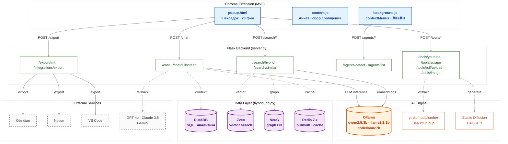

# FocusFlow AI 🧠

> **AI-ассистент продуктивности для браузера** — Chrome-расширение с мульти-агентным чатом, графом знаний, фокус-таймером и 20+ инструментами на базе локальных LLM (Ollama) и гибридной БД (DuckDB + Zvec + NeuG + Redis).


---

## ✨ Возможности

| Вкладка | Функции |
|:---|:---|
| 🤖 **AI (Чат)** | AI-суммаризация, YouTube-анализ, переключение LLM (Qwen/Llama/CodeLlama/GPT-4o/Claude/Gemini), гибридный поиск с цитированием, генерация изображений (SD/DALL-E), PDF-чат, объяснение кода, голосовой ввод |
| 🛠 **Инструменты** | Веб-скрапинг, запись процессов, перевод текста (RU/EN/DE/FR/ZH), AI-поиск |
| 🧠 **Знания** | Социальное выделение, интерактивный граф знаний на Canvas |
| 🤝 **Агенты** | Обнаружение AI-агентов (ChatGPT/Claude/Gemini/Ollama), бенчмаркинг 5 моделей, мониторинг fine-tuning LoRA |
| 🎯 **Фокус** | Pomodoro-таймер (25/15/5/50 мин), задачи с приоритетами, экспорт в Obsidian/Notion/VSCode |

---

## 🏗 Архитектура



---

## 🚀 Установка

### 1. Бэкенд (Flask + Ollama)

```bash
# Клонирование
git clone https://github.com/nanocubit/search-gateway.git
cd search-gateway/ai-browser-tracker

# Настройка окружения
cp .env.example .env
# Отредактируйте .env при необходимости

# Установка Python-зависимостей
cd server
pip install -r requirements.txt

# Установка моделей Ollama
ollama pull qwen2.5:3b
ollama pull llama3.2:3b
ollama pull codellama:7b

# Запуск сервера
python server.py
# → http://127.0.0.1:5000
```

### 2. Расширение Chrome

1. Откройте `chrome://extensions`
2. Включите **Режим разработчика**
3. Нажмите **Загрузить распакованное расширение**
4. Выберите папку `ai-browser-tracker/extension/`
5. Иконка FocusFlow AI появится в панели расширений

### 3. Docker (альтернатива)

```bash
docker compose up -d --build
docker compose exec ollama ollama pull qwen2.5:3b
# → http://127.0.0.1:5000
```

---

## ⚙️ Конфигурация

### `.env`

```env
# Токен авторизации (должен совпадать с background.js)
SECRET_TOKEN=ai-agent-hybrid-token-2026

# Ollama
OLLAMA_URL=http://localhost:11434/api/generate
OLLAMA_MODEL=qwen2.5:3b

# Redis
REDIS_HOST=127.0.0.1
REDIS_PORT=6379

# Stable Diffusion (опционально)
SD_API_URL=http://127.0.0.1:7860/sdapi/v1/txt2img

# DALL-E 3 (опционально)
OPENAI_API_KEY=sk-...

# Интеграции
OBSIDIAN_ENABLED=false
OBSIDIAN_VAULT_PATH=/path/to/vault
NOTION_ENABLED=false
NOTION_TOKEN=ntn_...
VSCODE_ENABLED=false
VSCODE_WORKSPACE_PATH=/path/to/workspace
```

### ⌨️ Клавиатурные команды

| Действие | Windows/Linux | macOS |
|:---|:---|:---|
| Объяснить выделенное | `Ctrl+Shift+E` | `⌘+Shift+E` |
| Перевести на русский | `Ctrl+Shift+R` | `⌘+Shift+R` |
| Суммаризировать | `Ctrl+Shift+S` | `⌘+Shift+S` |
| Перевести на English | `Ctrl+Shift+G` | `⌘+Shift+G` |

---

## 📡 API Endpoints

### AI / Чат

| Метод | Путь | Описание |
|:---|:---|:---|
| `POST` | `/chat` | Чат с AI (контекст из истории браузера) |
| `POST` | `/chat/fullscreen` | Полноэкранный чат (кастомная модель/system_prompt/история) |

### Поиск

| Метод | Путь | Описание |
|:---|:---|:---|
| `POST` | `/search/similar` | Векторный поиск (Zvec) + графовый контекст (NeuG) |
| `POST` | `/search/hybrid` | Гибридный поиск (ILIKE + вектор + attention score) |

### Данные

| Метод | Путь | Описание |
|:---|:---|:---|
| `POST` | `/save` | Сохранение page_visit / chat_message / network_request |
| `GET` | `/api/stats` | Статистика БД (таблицы, векторы, граф) |
| `GET` | `/api/graph/<id>` | Графовый контекст сообщения |
| `GET` | `/api/history/pages` | История посещённых страниц |
| `GET` | `/history/chat` | История сообщений чата |

### Агенты

| Метод | Путь | Описание |
|:---|:---|:---|
| `POST` | `/agents/detect` | Регистрация AI-агента |
| `GET` | `/agents/list` | Список активных агентов |

### Инструменты

| Метод | Путь | Описание |
|:---|:---|:---|
| `POST` | `/tools/youtube` | Анализ YouTube (yt-dlp → субтитры → Ollama) |
| `POST` | `/tools/scrape` | Веб-скрапинг (BeautifulSoup) |
| `POST` | `/tools/pdf/upload` | Загрузка PDF (pdfplumber) |
| `POST` | `/tools/image` | Генерация изображений (SD / DALL-E) |
| `POST` | `/api/benchmark` | Бенчмарк моделей Ollama |
| `GET` | `/api/finetune/status` | Статус fine-tuning |

### Экспорт

| Метод | Путь | Описание |
|:---|:---|:---|
| `GET` | `/export/<fmt>` | Экспорт в JSON/CSV/MD |
| `POST` | `/integrations/export` | Экспорт в Obsidian/Notion/VSCode |

---

## 📂 Структура проекта

```
ai-browser-tracker/
├── extension/                    # Chrome Extension MV3
│   ├── manifest.json             # Манифест v3, permissions, commands
│   ├── popup.html                # FocusFlow AI интерфейс (1288 строк)
│   ├── background.js             # Service worker: contextMenus, трекинг
│   ├── content.js                # Content script: сбор сообщений
│   ├── package.json              # Тесты Jest
│   ├── icons/                    # Иконки 16/48/128 px
│   └── tests/                    # Тесты расширения
│
├── server/                       # Flask бэкенд
│   ├── server.py                 # 503 строки, 20+ эндпоинтов
│   ├── hybrid_db.py              # DuckDB + Zvec + NeuG менеджер
│   ├── requirements.txt          # 18 Python зависимостей
│   ├── Makefile                  # install-deps, build-neug, test
│   ├── core/
│   │   ├── afk_monitor.py        # Мониторинг активности (pynput)
│   │   └── webhooks.py           # Webhook-менеджер (Redis pub/sub)
│   ├── exporters/
│   │   ├── dispatcher.py         # Диспетчер экспорта
│   │   ├── obsidian_exporter.py  # Obsidian MD экспорт
│   │   ├── notion_exporter.py    # Notion API экспорт
│   │   └── vscode_exporter.py    # VS Code Foam экспорт
│   └── tests/                    # pytest тесты
│
├── web/                          # Веб-интерфейс
│   ├── index.html                # Дашборд
│   ├── chat.html                 # Полноэкранный чат
│   ├── app.js
│   └── chat.js
│
├── agents/                       # Python AI-агенты
├── docker-compose.yml            # Redis + Ollama + Flask
├── Dockerfile
├── generate_icons.ps1            # Генерация PNG иконок
└── .env.example
```

---

## 🛠 Разработка

### Запуск тестов

```bash
# Python тесты
cd server && pytest tests/ -v

# JS тесты (Jest)
cd extension && npm test
```

### Добавление нового инструмента

1. Добавьте эндпоинт в `server.py` (POST с декоратором `@app.route`)
2. Добавьте `tool-card` в `popup.html` с `data-tool="имя"`
3. Создайте `div.tool-sub#sub-имя` с UI и обработчиком
4. Обновите README.md

### Сборка

```bash
# Установка NeuG (графовая БД)
cd server && make install

# Полная установка
pip install -r requirements.txt
```

---

## 📋 Требования

| Компонент | Минимум | Рекомендуется |
|:---|:---|:---|
| **Python** | 3.10 | 3.12 |
| **Ollama** | — | qwen2.5:3b, codellama:7b |
| **Redis** | 6.x | 7.x |
| **Chrome** | MV3 | Последняя версия |
| **RAM (сервер)** | 2 ГБ | 8 ГБ (с Ollama) |
| **RAM (расширение)** | — | 256 МБ |

---

## 📄 Лицензия

MIT © [Slava Maltsev](https://github.com/nanocubit)

---

<p align="center">
  <b>FocusFlow AI</b> — думай быстрее, работай умнее 🚀
</p>
